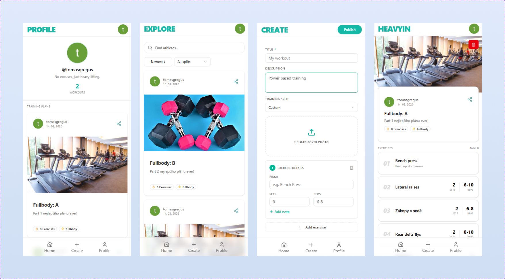

# HeavyIn

A fitness social platform for athletes to build, share, and discover workout training plans.

[heavyin.vercel.app](https://heavyin.vercel.app)

---

## Demo



---

## Features

- **Workout Builder** – Create structured training plans with exercises, sets, reps, and notes
- **Feed** – Discover and filter workouts from the community by split type (Push, Pull, Legs, Fullbody...)
- **Public Profiles** – View any athlete's training history and published workouts
- **Authentication** – Email/password and Google OAuth sign-in
- **User Search** – Find athletes by username
- **Workout Sharing** – Share workouts with Open Graph previews on social media
- **Settings** – Update profile, change password, delete account

---

## Stack

- **Next.js 16** – App Router, server components, TypeScript
- **Firebase** – Firestore database + Auth (email/password, Google OAuth)
- **Tailwind CSS v4** + shadcn/ui + Radix UI
- **Zod** – Form validation
- **Unsplash API** – Auto-generated workout cover images
- **Vercel** – Deployment

---

## Getting Started

```bash
git clone https://github.com/gregustomas/heavyin.git
cd heavyin
npm install
```

Create `.env.local`:

```
NEXT_PUBLIC_FIREBASE_API_KEY=
NEXT_PUBLIC_FIREBASE_AUTH_DOMAIN=
NEXT_PUBLIC_FIREBASE_PROJECT_ID=
NEXT_PUBLIC_FIREBASE_STORAGE_BUCKET=
NEXT_PUBLIC_FIREBASE_MESSAGING_SENDER_ID=
NEXT_PUBLIC_FIREBASE_APP_ID=
NEXT_PUBLIC_UNSPLASH_ACCESS_KEY=
```

```bash
npm run dev
```

Open [http://localhost:3000](http://localhost:3000).

